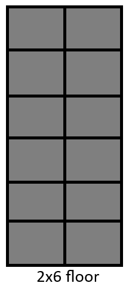

# CarpetMod Extension: Floor-Placer-Mod

## Description
Floor-Placer-Mod is an extension mod for CarpetMod designed to automate the process of building floors in Minecraft.

### Example Floor

1k x 5k floor fully printed by the mod.

## Features
- Automates floor building using the "/player \<name> buildFloor <filename> <rows> <columns>" command.
- Controls automation with "/player \<name> use interval <interval>" and "/player \<name> stop" commands.
- Requires floor layouts to be saved in the server's /resources folder.

## Installation
1. Ensure you have CarpetMod installed on your Minecraft server.
2. Ensure you have Syncmatica installed on your Minecraft server.
3. Download the latest release of Floor-Placer-Mod from the GitHub repository.
4. Place the downloaded .jar file into your server's "mods" folder.
5. Restart your Minecraft server.

## Usage
1. Ensure that CarpetMod, Syncmatica, and Floor-Placer-Mod are correctly installed and loaded on your server/client.
2. Save the schematic that you would like to build first selecting the north-west point, then the south-east point. Make sure that your schematic is in the x, z plane and only 1 block tall.
3. Create a placement of the schematic and use Syncmatica to sync it to the server. This is what uploads the file to a location where the mod is able to access it. The location of the synced schematic is not relevant. 
4. In-game, use the command "/player \<name> buildFloor schematic <schematic-name> <width> <length>" (see image below) to initialize the player. The width is how many tiles across, and the length is how many tiles long.
5. To build the floor use "/player \<name> use interval <interval>" to place blocks, and "/player \<name> stop" to pause the process.

## Saving and Loading
1. To save the progress first "/player \<name> stop" the player then "/player \<name> buildFloor save"
2. To load the progress "/player \<name> buildFloor load". Currently, only one build can be saved at a time, saving again overwrites the previous save.

## Example
- if "tile" is the name of a schematic then "/player \<name> buildFloor schematic tile 2 6" would produce the below result.

## Known Issues
1. Because the mod doesn't change the orientation of the blocks (they're all placed with the same orientation) blocks that require specific orientation are not compatible. 

## TODO
1. Fix BlockGenerator so that multiple builds can happen in parallel

## Contributing
Contributions to Floor-Placer-Mod are welcome! If you encounter any bugs or have suggestions for improvements, please open an issue on the GitHub repository.

## License
Floor-Placer-Mod is licensed under the [MIT License](LICENSE).

## Credits
Thank you to KikuGie for all the help.
